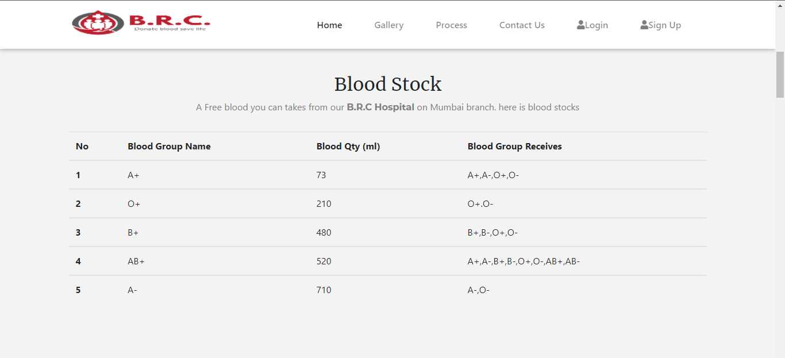
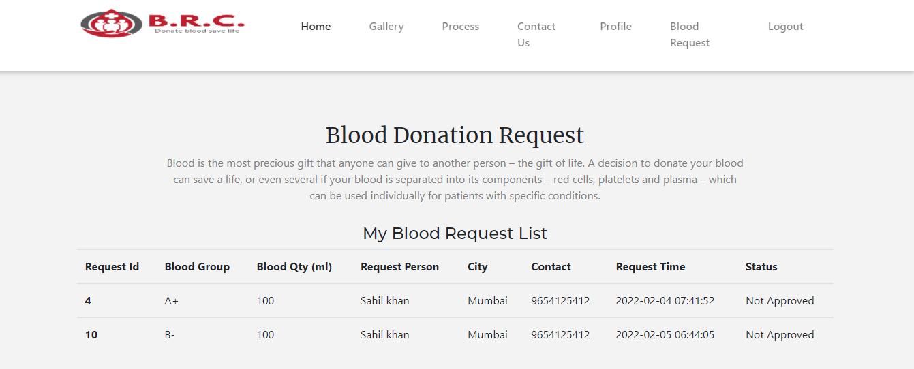
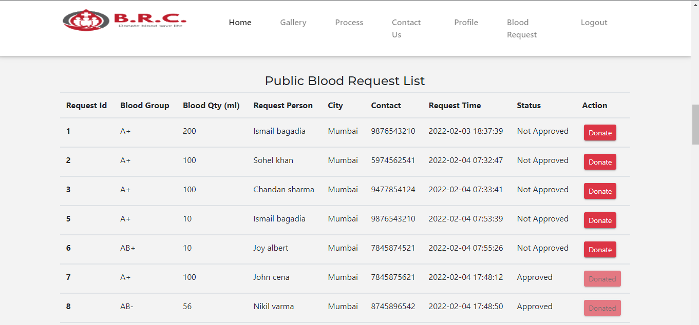

# “B.R.C. - Online blood donation portal”


## Features
- Check all available stocks of donated blood for use in case of an emergency.
- Helps patients who urgently need blood so that they can get blood on this platform and they can also donate blood for other help.


## Demo link(https://brc.azurewebsites.net)


## Screenshots









## Tech stack
- [Flask](https://flask.palletsprojects.com/) - web apps!
- [MySQL](https://www.mysql.com) - for RDBMS backend database
- [Azure](https://azure.microsoft.com/) - for cloud solution
- [jQuery](https://jquery.com/) - for manipulating the webpage
- [bootstrap](https://getbootstrap.com/) - for cool design

## Installation

- Requires [MySQL](https://www.mysql.com) and [Python](https://www.python.org).

- Import mysql structure from [here](/sqlstructure/)

- Clone this repo

- Install the dependencies and devDependencies and start the server.


```sh
pip install virtualenv
virtualenv mypython
mypthon\Scripts\activate
pip install -r requirements.txt
```

Done <3
